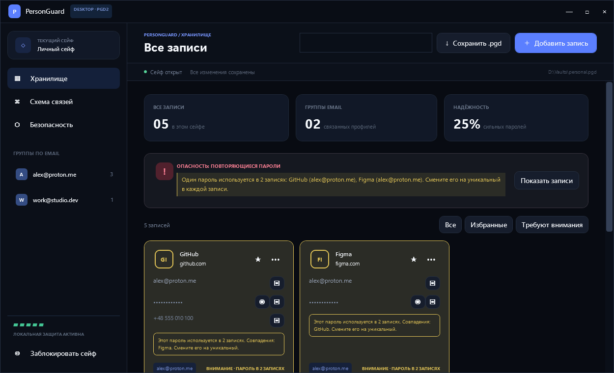
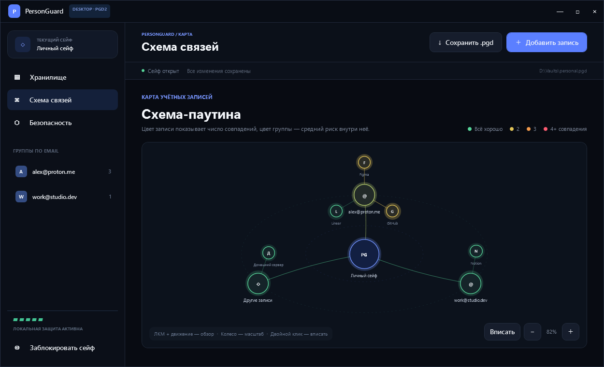
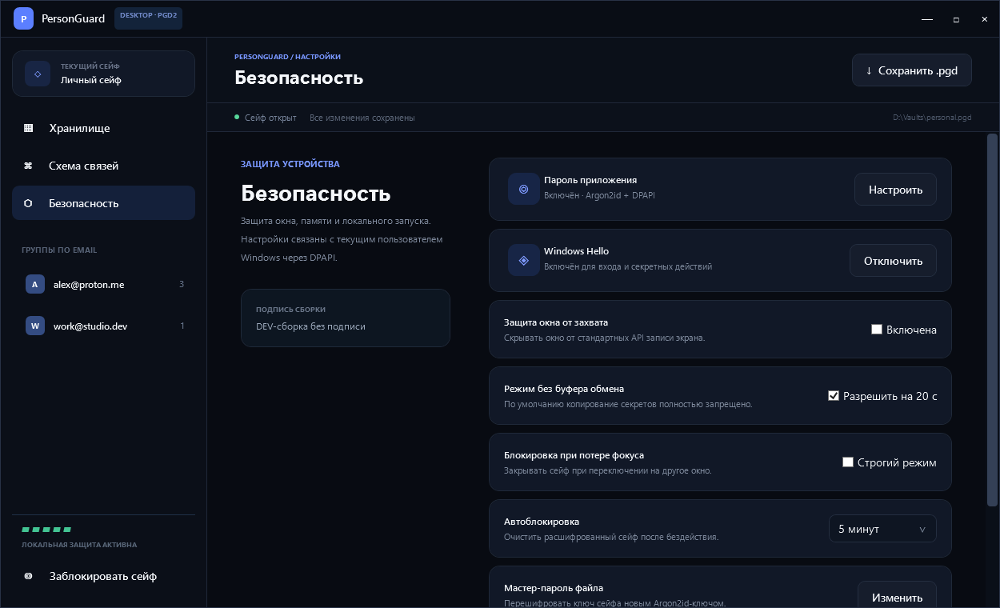
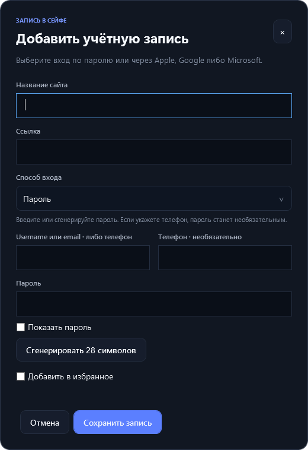
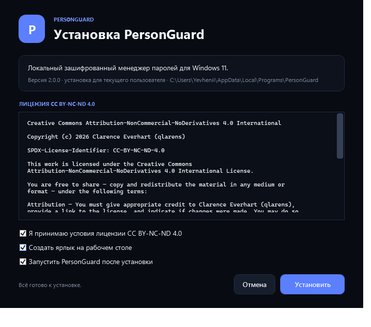

# PersonGuard


[](LICENSE)

PersonGuard — локальный менеджер паролей для Windows 11. Это нативное WPF-приложение без аккаунта, сервера, телеметрии, WebView и сетевой синхронизации. Все данные сейфа хранятся в одном переносимом файле `.pgd` и расшифровываются только на устройстве после ввода мастер-пароля.



> [!IMPORTANT]
> У PersonGuard нет облака и функции восстановления мастер-пароля. Храните резервную копию `.pgd` отдельно: потерянный мастер-пароль или повреждённый файл восстановить невозможно.

## Скачать и установить

Откройте [последний GitHub Release](../../releases/latest) и выберите один из вариантов:

- `PersonGuard-Setup.exe` — рекомендуемый установщик для текущего пользователя. Права администратора и отдельно установленный .NET не нужны;
- `PersonGuard.exe` — переносимая версия без установки.

PersonGuard поддерживает **Windows 11 x64**. Для каждого `.exe` в релизе публикуется отдельный файл `.sha256`.

Проверить загруженный файл можно в PowerShell:

```powershell
Get-FileHash .\PersonGuard-Setup.exe -Algorithm SHA256
Get-Content .\PersonGuard-Setup.exe.sha256
```

Хеши в двух строках должны совпасть. Статус цифровой подписи конкретной сборки всегда указывается в примечаниях к релизу. Если файл не подписан, Windows может показать предупреждение SmartScreen — не запускайте его, пока не сверите SHA-256 и источник загрузки.

Установщик создаёт ярлык в меню «Пуск», при желании — на рабочем столе, и регистрирует стандартное удаление в параметрах Windows. Обновление и удаление приложения не затрагивают `.pgd`-сейфы и личные настройки.

## Возможности

- создание, открытие и сохранение полностью зашифрованных `.pgd`-сейфов;
- отдельный мастер-пароль для каждого файла и безопасная смена мастер-пароля;
- записи с сайтом, URL, email/username, телефоном, паролем и отметкой «Избранное»;
- вход без локального пароля через Apple, Google или Microsoft с группировкой по связанному email;
- поиск повторяющихся паролей, перечень затронутых записей и динамическая шкала риска;
- автоматическая группировка записей по email;
- интерактивная схема связей «сейф → email-группа → записи»;
- отдельный пароль запуска приложения и поддержка Windows Hello;
- повторная авторизация перед показом или копированием секрета;
- отключённый по умолчанию буфер обмена с автоочисткой через 20 секунд;
- автоблокировка при бездействии, сворачивании и блокировке Windows;
- защита окна от большинства стандартных средств захвата экрана;
- перенос файлов PGD1 в PGD2 при следующем сохранении.

<details>
<summary>Другие скриншоты</summary>

### Схема связей



### Настройки безопасности



### Добавление записи



### Установщик



</details>

## Как защищены данные

PersonGuard использует публичные, проверяемые криптографические примитивы: **Argon2id** для вывода ключа из мастер-пароля и **AES-256-GCM** для аутентифицированного шифрования. Для каждого сейфа создаётся случайный ключ данных; смена мастер-пароля переоборачивает этот ключ без сохранения самого пароля. Заголовок контейнера и зашифрованное содержимое защищены от незаметной подмены.

Названия алгоритмов и их параметры не являются секретом и не заменяют ключ. Более того, идентификаторы алгоритмов и параметры KDF находятся в заголовке самого `.pgd`, поэтому их сокрытие не добавило бы реальной защиты. Безопасность должна зависеть от стойкости алгоритма, уникального мастер-пароля и сохранности ключей, а не от неизвестности реализации.

Не следует публиковать реальные сейфы, мастер-пароли, ключи подписи, `.pfx`-файлы, токены CI или дампы памяти. Полная модель угроз, формат PGD2 и ограничения desktop-защиты описаны в [SECURITY.md](SECURITY.md).

> [!WARNING]
> Проект не заявляет о независимом аудите безопасности. Вредоносная программа с правами текущего пользователя, администратора или ядра может перехватывать ввод, читать память процесса или подменять приложение. Защита окна также не предотвращает съёмку внешней камерой.

## Сборка из исходного кода

Для сборки нужен **.NET 10 SDK**. Скрипты сначала ищут локальный SDK в `.dotnet`, затем используют `dotnet` из `PATH`; версии NuGet-зависимостей зафиксированы lock-файлом.

```powershell
.\build-desktop.ps1
```

Результат:

```text
desktop/artifacts/win-x64/PersonGuard.exe
desktop/artifacts/win-x64/PersonGuard.exe.sha256
```

Сборка установщика:

```powershell
.\build-installer.ps1
```

Результат:

```text
desktop/artifacts/installer/PersonGuard-Setup.exe
desktop/artifacts/installer/PersonGuard-Setup.exe.sha256
```

При наличии сертификата подписи кода задайте его отпечаток в `PERSONGUARD_SIGNING_THUMBPRINT`. Скрипт принимает только подпись со статусом `Valid`; без сертификата он явно создаёт неподписанную DEV-сборку.

Запуск проверок:

```powershell
.\.dotnet\dotnet.exe run `
  --project .\desktop\PersonGuard.SecurityTests\PersonGuard.SecurityTests.csproj `
  -c Release
```

Браузерная версия в `dist` сохранена только как ранний прототип интерфейса. Не используйте её для реальных секретов.

## Публикация релиза

Готовый текст для GitHub Release, контрольные суммы и точный список загружаемых файлов находятся в [RELEASE_NOTES.md](RELEASE_NOTES.md).

В GitHub Release нужно добавить четыре файла:

1. `PersonGuard-Setup.exe`;
2. `PersonGuard-Setup.exe.sha256`;
3. `PersonGuard.exe`;
4. `PersonGuard.exe.sha256`.

Каталоги сборки, `.pdb`, локальный SDK, тестовые сейфы и файлы с ключами публиковать не нужно. Архивы исходного кода GitHub добавит к релизу автоматически.

## Лицензия

Copyright © 2026 Clarence Everhart (qlarens).

Проект распространяется на условиях [Creative Commons Attribution-NonCommercial-NoDerivatives 4.0 International](LICENSE). Лицензия разрешает распространение неизменённых копий с указанием авторства, запрещает коммерческое использование и распространение производных версий.
